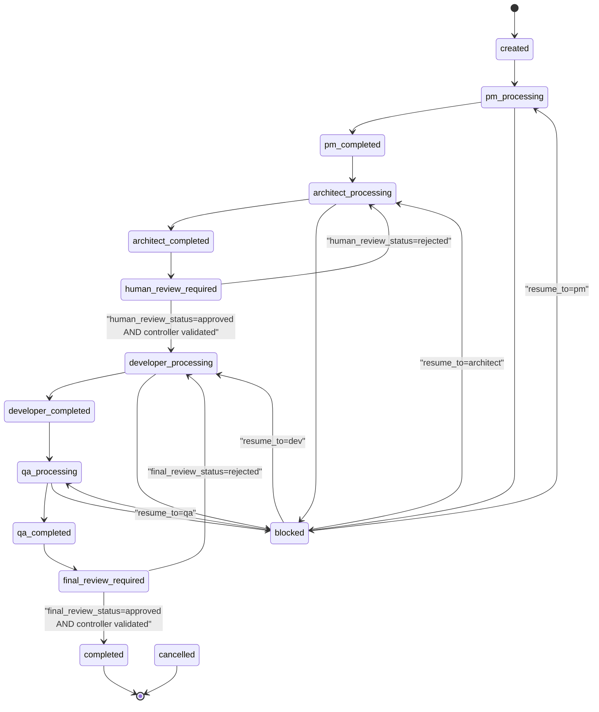

# State Machine

> `state.current_status` 的合法迁移与转移规则。仅 Flow Controller 可执行迁移。

## 1. 状态枚举

`current_status` 共 14 个：

```
created
pm_processing      pm_completed
architect_processing  architect_completed
human_review_required
developer_processing  developer_completed
qa_processing      qa_completed
final_review_required
completed
blocked
cancelled
```

> 注意：`human_review_approved` / `human_review_rejected` / `final_approved` / `final_rejected` **不在** `current_status` 枚举中；这些信息由 `state.human_review_status` / `state.final_review_status` 字段承载。

## 2. 状态迁移图



## 3. 转移规则表

每条转移：触发事件 / 校验函数 / 写哪些文件 / 失败回退。

### 3.1 created → pm_processing

- 触发：Controller 收到 User 启动 Task 的指令
- 校验：`task.md` 已创建且 frontmatter 合法 / `active-task.md` 已设
- 写入：`state.md`（current_status = pm_processing, current_agent = pm, next_agent = architect）+ `messages/from-controller-001-handoff.md`
- 失败：created → blocked（缺 task 元信息）

### 3.2 pm_processing → pm_completed

- 触发：PM 写完 `requirement.md` / `prd.md` / `task-breakdown.md` / `messages/from-pm-*-handoff.md`
- 校验：`product-manager-to-architect.md` 的 acceptance_criteria 全部通过
- 写入：`state.md`（current_status = pm_completed）
- 失败：pm_processing → blocked（artifact 缺漏或 handoff message 缺失）

### 3.3 pm_completed → architect_processing

- 触发：Controller 推进
- 校验：所有 PM Artifact status == ready
- 写入：`state.md`（current_status = architect_processing, current_agent = architect, next_agent = human-review-actor）+ `messages/from-controller-002-handoff.md`

### 3.4 architect_processing → architect_completed

- 触发：Architect 写完 `tech-plan.md` / `file-change-plan.md` / `risk-plan.md` / `messages/from-architect-*-handoff.md`
- 校验：`architect-to-human-review.md` 的 acceptance_criteria 全部通过 + file-change-plan 7 字段完整
- 写入：`state.md`（current_status = architect_completed）

### 3.5 architect_completed → human_review_required

- 触发：Controller 推进
- 写入：`state.md`（current_status = human_review_required, current_agent = human, human_review_status = pending）+ `messages/from-controller-003-handoff.md`

### 3.6 human_review_required → developer_processing（**双步原子操作**）

- 触发：Human Review Actor 写入 `human-reviews/architect-review.md`（verdict: approved）
- 校验：review record 字段完整（review_id / review_type / verdict / reviewer / reviewed_at / reviewed_artifacts）
- 写入分两步（不可合并）：
  1. **第一步**：`state.human_review_status = approved`
  2. **第二步**：`state.current_status = developer_processing`，`current_agent = dev`，`next_agent = qa`
- 写一条 `messages/from-controller-004-handoff.md` 召唤 Dev

### 3.7 human_review_required → architect_processing

- 触发：Human Review Actor 写入 `architect-review.md`（verdict: rejected 或 needs_changes）
- 写入：`state.human_review_status = rejected`，`current_status = architect_processing`，附 issues 反馈

### 3.8 developer_processing → developer_completed

- 触发：Dev 写完 `implementation-log.md` / `changed-files.md` / `messages/from-developer-*-handoff.md`
- 校验：`developer-to-qa.md` acceptance_criteria + `changed-files.md` 越界审计无未授权改动

### 3.9 developer_completed → qa_processing

- 触发：Controller 推进
- 写入：`state.md`（current_status = qa_processing, current_agent = qa）

### 3.10 qa_processing → qa_completed

- 触发：QA 写完 `test-report.md` / `acceptance-checklist.md` / `messages/from-qa-*-handoff.md`
- 校验：所有用例 status 字段非空 + pass 数 + manual_required 数 ≥ 用例总数 × 90%

### 3.11 qa_completed → final_review_required

- 触发：Controller 推进
- 写入：`state.md`（current_status = final_review_required, final_review_status = pending）

### 3.12 final_review_required → completed（**双步原子操作**）

- 触发：Human Review Actor 写入 `human-reviews/final-review.md`（verdict: approved）
- 校验：review record 字段完整 + test-report 中无未处理 fail
- 写入分两步：
  1. **第一步**：`state.final_review_status = approved`
  2. **第二步**：`state.current_status = completed`
- 仅在第二步完成后，Controller 才允许写 `artifacts/final/final-delivery.md`

### 3.13 final_review_required → developer_processing

- 触发：Human Review Actor 写入 `final-review.md`（verdict: rejected）
- 写入：`state.final_review_status = rejected`，`current_status = developer_processing`

### 3.14 任意状态 → blocked

- 触发：上游 Agent 写 `messages/from-<role>-*-blocker-request.md`，或 Controller 自校验失败
- 写入：Controller 创建 `blockers/B-*.md`（11 字段）+ `state.md`（previous_status = current_status, current_status = blocked, blocked_context 镜像 11 字段, active_blocker = blocker_id, blockers_history 追加）

### 3.15 blocked → resume_to_status

- 触发：缺失 artifact 已补齐
- 校验：Controller 读 `state.blocked_context.missing_artifacts`，逐一确认
- 写入：`state.md`（current_status = blocked_context.resume_to_status, current_agent = blocked_context.resume_to_agent, blocked_context = null, active_blocker = null）

### 3.16 任意状态 → cancelled

- 触发：用户显式指令取消
- 写入：`state.md`（current_status = cancelled）

## 4. 关键澄清

- **审核翻转必须双步**，任何"我同意，直接进开发"的口头指令都不能跳过 Controller 校验
- **`human_review_status == approved` 仅是审核闭环状态，不是写代码授权**；只有 `current_status == developer_processing` AND `human_review_status == approved` 同时满足时，Dev Agent 才被授权写源码
- **Controller 不写 review record**；只有 Human Review Actor 写
- **Controller 不写 `artifacts/{pm,architect,developer,qa}/**`**；只能在 `final_review_status == approved` 后写 `artifacts/final/final-delivery.md`，且只引用不改写
