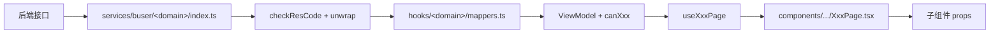
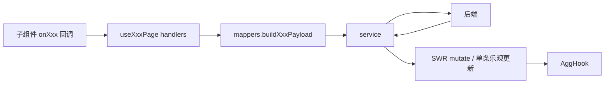
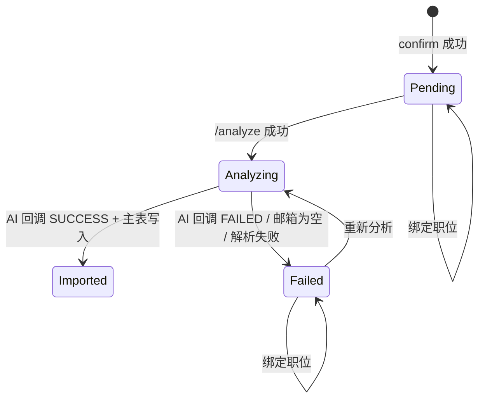
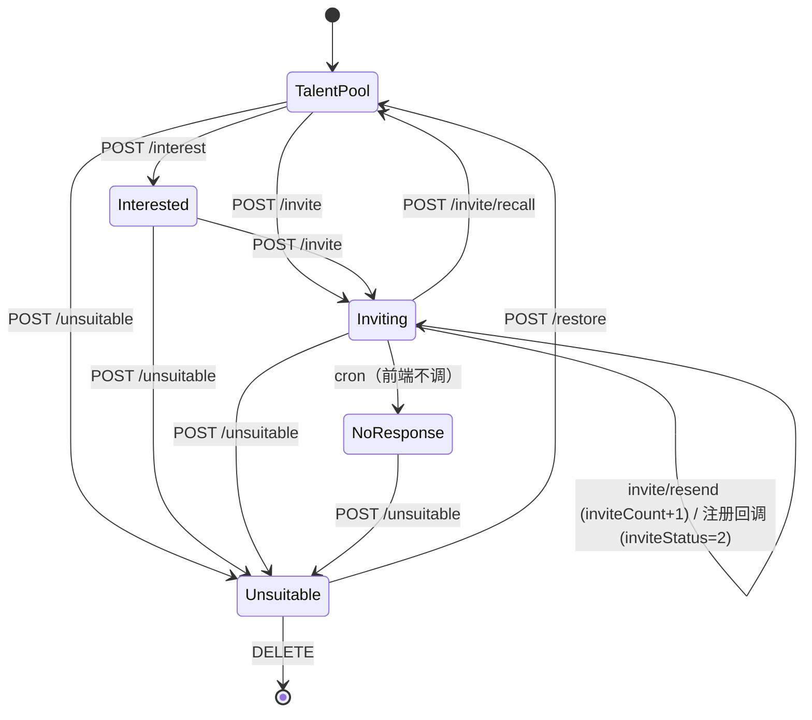

# Tech Plan: 平台管理 + 批量简历上传前端联调

> 11 节均必填。"最小可行方案"非空。不引入新依赖。不动 lock / CI / Dockerfile / axiosConfig / middleware。

## 1. 影响范围

### 新增

- `services/buser/resumeUpload/index.ts`（7 个上传 + 分析接口）
- `services/buser/platformManagement/index.ts`（9 个平台管理接口）
- `hooks/buser/resumeUpload/baseHooks.ts`（上传 / 分析 / 绑定 / 删除 base hooks）
- `hooks/buser/platformManagement/baseHooks.ts`（Tab 列表 / 详情 / 状态流转 / 邀请 base hooks）

### 修改

- `types/buser/resumeUpload/index.ts`（DTO + ViewModel + 枚举 union；保留现有导出名以兼容 import）
- `types/buser/platformManagement/index.ts`（同上）
- `hooks/buser/resumeUpload/mappers.ts`（接入新 DTO；payload builder）
- `hooks/buser/platformManagement/mappers.ts`（接入新 DTO；payload builder；canXxx 字段）
- `hooks/buser/resumeUpload/useResumeUploadPage.ts`（编排：presign → PUT → confirm + bind + delete + analyze）
- `hooks/buser/platformManagement/usePlatformManagementPage.ts`（编排：5 Tab + 详情 + 状态 + 邀请；移除关键词搜索）
- `hooks/buser/resumeUpload/index.ts`、`hooks/buser/platformManagement/index.ts`（barrel export）
- 上传组件 8 个、平台管理组件 9 个（含详情弹窗与洞察面板；列表列与行操作按矩阵）
- `app/buser/resumeUpload/page.tsx`、`app/buser/platformManagement/page.tsx`（仅编排）

### 不变（显式禁改）

- `package.json` / lock 文件 / `.github/**` / `.gitlab-ci.yml` / `Dockerfile` / `.husky/**` / `.eslintrc*` / `tsconfig.json`
- `services/axiosConfig.ts`（baseURL 已含 `/api/v1`，不需要改）
- `middleware.ts`（本期无新增公开路由）
- `next.config.*`、全局主题、antd ConfigProvider、菜单 / 路由配置
- `services/common/upload.ts`（旧 multipart 中转路径保留作历史调用方，不复用、不删除）

### 间接影响

- 仅本两模块；菜单 / 路由 / 权限不动。

## 2. 模块边界

| 层 | 路径 | 职责 | 禁止 |
|---|---|---|---|
| 路由层 | `app/buser/{resumeUpload,platformManagement}/page.tsx` | 注册路由 + 挂载聚合组件 / 透传聚合 hook 返回值 | 写 service / 写业务 handler / 写 useEffect 请求 |
| 编排组件 | `components/buser/{resumeUpload,platformManagement}/XxxPage.tsx` | 组装子组件，桥接 hook handlers | 写 payload / 调 service / 直接消费 raw response |
| 子组件 | `components/buser/<domain>/*.tsx` | 受 props 渲染 + 触发回调 | 发请求 / 自持业务 state |
| 聚合 hook | `hooks/buser/<domain>/useXxxPage.ts` | state 编排 + SWR + 拼装 handlers + 返回稳定 ViewModel | 在 page / 组件外暴露 raw response |
| 基础 hook | `hooks/buser/<domain>/baseHooks.ts` | 子能力（上传队列 / 分析 / 邀请 / Tab 列表 / 详情 / 状态流转） | 跨模块共享 state |
| mapper | `hooks/buser/<domain>/mappers.ts` | Raw → ViewModel + payload builder + canXxx 派生字段 | 副作用（请求 / toast / DOM） |
| service | `services/buser/<domain>/index.ts` | 纯 HTTP + 泛型返回 | UI 反馈 / 业务判断 |
| type | `types/buser/<domain>/index.ts` | DTO（与后端契约对齐）+ ViewModel + 联合枚举 | `any` / `as any` / 隐式推断业务字段 |

模块间通信约定：

- 上传 / 平台管理两域**完全独立**，**不通过任何全局 store 通信**。
- 上传成功 → AI 回调 → 进入平台管理列表的衔接由后端完成；前端不主动跨域 mutate（用户切到平台管理页时 SWR 自然拉取）。
- Job 选项跨域复用 `searchJobPositionByEs`（来自 `services/buser/jobs`），两域各自维持 SWR cache。

## 3. 数据流

### 3.1 读路径（API → UI）



### 3.2 写路径（Form / 操作 → API）



### 3.3 DTO normalize 规则（强约束）

| 字段类型 | DTO 类型 | mapper 输出 | 备注 |
|---|---|---|---|
| Long ID（`id / uploadItemId / talentResumeId / jobId / aiTaskId`） | `string` | `string` | DTO 直接 `string`；前端**不再做 `String(id)`**（后端已是 string） |
| 分页 `current / size / pages / total` | `number \| string` | `number`（仅传 antd Pagination） | mapper 内 `Number(...)`；空值 → 0 |
| `fileSize` | `number \| string \| null` | `string` 展示（人类可读，如 `3.0 MB`），同时保留 `number` 原值 | 展示走 ViewModel `fileSizeLabel`；不参与 ID 拼接 |
| `matchScore` | `number \| null` | `number`（0..100） | 兜底 null → `'-'` |
| `inviteCount / maxInviteCount` | `number \| null` | `number` | 兜底 null → 0 |
| 时间 `*At` | `string \| null` | `string` 原样 | 不做时区转换 |
| `phone` | `string \| null` | `string` 原样（已脱敏） | 不再处理 |
| `failureReason` | `string \| null` | `string`，null → `''`（仅在 `analysisStatus=2` 时显示） | |
| `highlights / riskPoints / interviewSuggestions` | `string[] \| null` | `string[]` | mapper 兜底 `?? []` |

### 3.4 ViewModel canXxx 派生字段（强约束：在 **mapper** 内一次性生成）

上传明细（`UploadItemViewModel`）：

```
canBindJob      = analysisStatus === 0 || analysisStatus === 2
canDelete       = analysisStatus === 0 || analysisStatus === 2
canAnalyze      = (analysisStatus === 0 || analysisStatus === 2) && jobId != null
canRetry        = analysisStatus === 2 && jobId != null
isAnalyzing     = analysisStatus === 1
isAnalysisFailed= analysisStatus === 2
```

平台管理人才（`PlatformResumeViewModel`）：

```
canInterest     = hrStatus === 0
canInvite       = (hrStatus === 0 || hrStatus === 1) && inviteCount < 3
canResend       = hrStatus === 2 && inviteStatus === 1 && inviteCount < 3
canRecall       = hrStatus === 2 && inviteStatus === 1
canUnsuitable   = hrStatus !== 4
canRestore      = hrStatus === 4
canDeleteResume = hrStatus === 4
inviteCountLabel= `${inviteCount}/3`
```

> **组件不重复 if 判断**；只读这些 boolean。

## 4. 状态流

### 4.1 上传明细 analysisStatus



### 4.2 平台管理 hrStatus



## 5. 接口契约

完整接口清单与字段类型风险见 `artifacts/pm/api-contract-checklist.md`。

**Architect 收敛**：

| # | 接口 | 方法 | 入参（请求体 ID 类型） | 返回 ID 类型 | 已通过 |
|---|---|---|---|---|---|
| 1 | `/hire/talent/resume/upload/presign` | POST | `jobId: string \| null`, `fileName/contentType/contentDisposition: string`, `fileSize: number` | 全 string | ✓ |
| 2 | `/hire/talent/resume/upload/confirm` | POST | `uploadItemId/cosKey: string`, `fileSize: number`, `fileName/contentType: string` | 全 string | ✓ |
| 3 | `/hire/talent/resume/upload/stat` | POST | `null` | 三字段 string | ✓ |
| 4 | `/hire/talent/resume/upload/page` | POST | `current/size: number`, `analysisStatus?/uploadStatus?: number`, `jobId?: string` | 分页 string，items 字段混用 | ✓ |
| 5 | `/hire/talent/resume/upload/bind-job` | POST | `uploadItemIds: string[]`, `jobId: string` | `successCount/failedCount: number` | ✓（请求体 jobId 测试报告为 number；Architect 决策见附录 Q4） |
| 6 | `/hire/talent/resume/upload/delete` | POST | `uploadItemIds: string[]` | 同 5 | ✓ |
| 7 | `/hire/talent/resume/analyze` | POST | `uploadItemIds: string[]` | `items[].aiTaskId: string`, `analysisStatus: number` | **SKIP** |
| 8 | `/hire/talent/resume/page` | POST | `current/size: number`, `hrStatus: number`, 其它 string 字段 optional | 字段混用见 §3.3 | ✓ |
| 9 | `/hire/talent/resume/{id}/ai-insight` | GET | `id: string`（路径参数） | `aiInsight[*]: string[] \| null` | ✓ |
| 10 | `/hire/talent/resume/{id}/interest` | POST | 空 | `from/toStatus: number` | ✓ |
| 11 | `/hire/talent/resume/{id}/unsuitable` | POST | `reasonType: 1\|2\|3\|4`, `reasonRemark?: string` | 同 10 | ✓ |
| 12 | `/hire/talent/resume/{id}/restore` | POST | 空 | 同 10 | ✓ |
| 13 | `DELETE /hire/talent/resume/{id}` | DELETE | 空 | `{deleted: boolean, deletedAt: string}` | ✓ |
| 14 | `/hire/talent/resume/{id}/invite` | POST | 空 | 邀请字段 number | ✓ |
| 15 | `/hire/talent/resume/{id}/invite/resend` | POST | 空 | 同 14 | ✓ |
| 16 | `/hire/talent/resume/{id}/invite/recall` | POST | 空 | 同 14 | ✓ |

错误码（PRD §3.13）`TALENT_RESUME_NOT_FOUND` / `INVALID_HR_STATUS` / `EMAIL_EMPTY` / `INVITE_COUNT_EXCEEDED` / `INVITE_NOT_SENT` / `INVITE_ALREADY_REGISTERED` / `DELETE_NOT_ALLOWED` / `UNSUITABLE_REASON_REQUIRED` —— **不在前端硬编码兜底文案**；走 axios 拦截统一 toast，hook catch 跳过 `isBusinessError`。

## 6. 权限控制点

| 层 | 控制点 | 实现 |
|---|---|---|
| 路由 | 仅 buser 已登录 | 沿用现有 `app/buser/layout.tsx` 鉴权拦截，不动 middleware |
| 接口 | 自动注入 Authorization | 沿用 `axiosConfig.ts` 拦截器；无新公开 / 匿名接口 |
| 按钮可见性 | 行操作显隐 | mapper 内 canXxx 派生字段 → 组件直读 |
| 数据范围 | 企业级隔离 | 后端按 `companyId` 自动过滤；前端不再传 companyId |

## 7. 第三方依赖

| 依赖 | 版本 | 必要性 | 引入风险 |
|---|---|---|---|
| `axios` | 现有 | 复用 | - |
| `swr` | 现有 | 复用 | - |
| `antd` | 现有 | 复用 | - |
| `clsx` / `tailwind-merge` | 现有 | 复用 | - |
| **不引入新依赖** |  |  |  |

特别说明（覆盖 PM OQ-07）：

- **不引入 AI dev mock**。理由：mock 代码涉及 hook / service / 类型多层污染，与后端 AI 服务对接的真实代价比 mock 大；本期允许 dev 环境"分析中长时间无更新"作为已知现象，QA 走"邮箱为空失败 / AI 内部回调（已通过）"两条链路验证 UI 状态切换。一旦后端 AI analyze 上线，前端无需任何代码变更即可联通。
- **不引入 COS SDK**。后端已移除 multipart 字段，单 PUT 用 axios + onUploadProgress 即可。

## 8. 最小可行方案（必填）

> 最少改动 + 最简实现。

- **复用**：`useSWR` / `checkResCode` / `unwrap` / `appMessage` / `searchJobPositionByEs` / 现有 `components/.../styles.ts` / antd 组件 / `clsx` / `tailwind-merge`。
- **不引入**：COS SDK、tus、AI mock、新 store、新中间件、新依赖。
- **不重构**：菜单、路由、权限、`services/axiosConfig.ts`、`services/common/upload.ts`、`middleware.ts`、global theme。
- **拆分粒度**：聚合 hook + baseHooks + mappers，三层下沉；不把所有逻辑硬塞 useXxxPage 致 >300 行。
- **类型**：DTO 单独命名（如 `UploadItemRaw / PlatformResumeListItemRaw / PlatformResumeDetailRaw`），ViewModel 单独命名（保留现有 `ResumeUploadFileViewModel / PlatformCandidateViewModel` 名字以减少 import diff，但**字段大改**）。
- **不可观察的优化**：不实现轮询去抖、不实现 IndexedDB 上传断点（后端不支持）、不实现详情预取。

## 9. 风险点

> 完整 risk-plan 见 `risk-plan.md`。本节只 surface 高级别。

| 风险 | 等级 | 触发条件 | 缓解 |
|---|---|---|---|
| AI analyze 接口 SKIP | P0 / 跨域 | 后端 AI 任务接收接口未提供 | UI 接受"分析中无更新"，不引入 mock；待后端上线零代码变更联通 |
| AI 成功回调 JSONB 写入失败 | P0 / 跨域 | 后端 MyBatis JSONB TypeHandler 未配置 | 前端不补偿；行存在 `analysisStatus=1` > 5min 时 Tooltip 提示"AI 处理较慢" |
| 数字字符串混用 | P1 / 前端 | 分页 / fileSize / matchScore 等字段 string 与 number 混 | DTO 联合类型 + mapper normalize 唯一收敛点 |
| confirm 失败 | P1 / 前端 | PUT 成功但 confirm 网络中断 | hook 层 utility 退避重试 3 次（1s / 2s / 4s） |
| presign 过期 | P1 / 前端 | 用户停顿 > 10min 后 PUT | 首次 PUT 失败 → 重申 presign 1 次（同文件保持原文件 id） |
| inviteCount=3 已达上限 | P1 / 业务 | 重发达 3 次 | 按钮 disabled + tooltip；后端兜底 `INVITE_COUNT_EXCEEDED` |
| inviteStatus=2 已注册不可撤回 / 重发 | P1 / 业务 | 撤回按钮误点 | 按操作矩阵隐藏；后端兜底 `INVITE_ALREADY_REGISTERED` |
| 邮件到达不可证 | P2 / 跨域 | 邀请 toast 文案误导 HR | toast 文案明示"已提交发送，候选人可能需要几分钟收到" |

## 10. 回滚方案

### 全量回滚

- 本 Task 改动全部位于 `services/buser/{resumeUpload,platformManagement}`、`hooks/buser/{resumeUpload,platformManagement}`、`components/buser/{resumeUpload,platformManagement}`、`types/buser/{resumeUpload,platformManagement}`、`app/buser/{resumeUpload,platformManagement}/page.tsx` 五个目录子集；
- 回滚通过 `git revert` Phase 级 PR（详 architect-handoff §5 Phase 1-4），每个 Phase 独立可回滚；
- 回滚边界：无数据库写入；无 cookie / localStorage 持久化前端态（除上传组件瞬时态）；不需要清理服务端数据。

### 局部回滚

| 风险触发 | 回滚动作 |
|---|---|
| AI 分析行为变更（后端先上线 analyze） | 不需回滚；前端契约不变 |
| 数字字段类型变更（后端统一 string 或 number） | 改 mapper normalize 单点；不动组件 |
| 详情预览方式变更 | 改 `PlatformResumePreviewModal.tsx` 单文件 |
| 上传进度组件性能问题 | 关闭 `onUploadProgress` 监听，回退为完成态切换 |

## 11. 待确认问题

> 用户在 Architect Review 时给方向。

- [ ] **AI dev mock 是否允许？**（Architect 默认推荐 **不允许**；详 §7 与附录 Q5）
- [ ] **`analysisStatus=1` 行的轮询周期与超时阈值**：默认 5000ms 轮询 + 5min Tooltip；可调
- [ ] **`canXxx` 派生字段放 mapper（默认）还是 hook**：Architect 默认 **mapper**
- [ ] **请求体 `jobId`：string（默认）还是 number**：默认 **string**（与 `07-type-id-field-convention` 一致；测试报告 number 也通过，后端宽容）
- [ ] **附件 preview 失败 fallback**：默认 `iframe + onError → 切换为下载按钮`；不引入预览代理
- [ ] **上传进度展示**：默认 axios `onUploadProgress`，行级 antd Progress；用户取消时 `AbortController.abort()`
- [ ] **confirm 重试落点**：默认 hook 层 utility（`retryConfirm(uploadItemId, ctx)`），最多 3 次 1s/2s/4s
- [ ] **乐观更新策略**：`/analyze` 成功后单条 SWR 缓存更新 + 并行 mutate `/upload/stat`，不全表 mutate
- [ ] **详情弹窗与列表 SWR 联动**：标记不合适 / 邀请 / 撤回成功 → 关闭弹窗 + mutate 列表 + mutate 当前 Tab；不主动 mutate 详情
- [ ] **`task.md` 标题 "Pilot task" 与实际需求不一致**（OQ-05）：Architect 不阻塞，但建议 Controller 在 Human Review 前发 message 锁定 task slot

---

## 附录：回答 PM handoff 中的 architect_must_answer（逐条）

### Q1：service 路径前缀是 `/hire/talent/resume/...` 还是 `/api/v1/hire/talent/resume/...`？

**A**：写 **`/hire/talent/resume/...`**。
依据：读 `services/axiosConfig.ts` 第 38-41 行，`baseURL = '/api/v1'`（生产环境）或 `${API_URL}/api/v1`（dev）。所有 service 函数填业务相对路径，不重复 `/api/v1`。

### Q2：SWR 轮询策略？

**A**：分两层。

| 场景 | refreshInterval | 触发条件 |
|---|---|---|
| 上传明细列表（仅 `analyzing` 子 Tab 且行数 > 0） | 5000ms | hook 内 `useMemo` 推导 enabled |
| 上传明细列表（其他 Tab） | 0（关闭） | |
| `/upload/stat` | 0（关闭） | 仅在"上传成功 / 删除 / 绑定 / 分析"成功后由 mutate 联动 |
| 平台管理列表 | 0（关闭） | 切 Tab / 筛选 / 操作成功后 mutate |
| `/ai-insight` 详情 | 0（关闭） | 仅 modal open 时 fetch；close 即 SWR cache 保留但不再 fetch |

不引入 WebSocket / SSE。

### Q3：附件预览失败 fallback 实现细节？

**A**：

1. 详情弹窗"附件简历"Tab 优先用 `<iframe src={attachment.previewUrl} title="..." onLoad={...} onError={...} />`；
2. iframe `onError` 或 `onLoad` 后 10s 未收到内容渲染 → 切换为"下载附件"按钮（`<a href={attachment.downloadUrl} download>`）；
3. 不引入 PDF.js 等第三方库；
4. 仅在弹窗内 fallback，不污染列表附件入口（列表入口直接打开 PreviewModal）；
5. 用户体验降级：iframe / 下载二选一，不阻塞操作。

### Q4：请求体 ID 字段类型统一？

**A**：**全 string**。

- 与 `07-type-id-field-convention.rule.mdc` 一致；
- 测试报告中 `bind-job` 入参传 number 也通过，说明后端宽容；前端按 string 走更安全（避免 Long 精度风险传递回后端）；
- mapper 内 payload builder 内统一 `String(jobId)`。

### Q5：触发 `/analyze` 成功后的乐观更新模式？

**A**：**单条乐观更新 + 联动 mutate**。

- 接收 `items[]` 返回值，按 `uploadItemId` 单条更新 SWR cache（将该行 `analysisStatus` 从 0/2 → 1，写入 `aiTaskId`）；
- 并行 `mutate('upload-stat-key')` 触发统计刷新；
- 不全表 `mutate('upload-page-key')`，避免大列表抖动；
- 若 hook 内 enable 了轮询（Q2），下一轮 `refreshInterval` 会自动覆盖乐观更新结果。

### Q6：是否在 dev 环境引入 AI mock？

**A**：**不引入**。

- mock 代码会污染 service / hook / 类型层；prod 排除依赖 env 判断，易出错；
- 邮箱为空失败链路（AI 内部回调）已可测；UI 三个状态（待分析 / 分析中 / 分析失败）可由"主动调 analyze → 状态进入 1"覆盖前两个，"邮箱为空回调"覆盖第三个；
- 仅"分析中 → 已导入"这一段无法 dev 端到端，QA 与 Human 接受此现状。

### Q7：上传进度库选型？

**A**：**axios `onUploadProgress`**。

- 单 PUT（后端已移除 multipart）；
- 进度通过 antd `Progress` 行级展示；
- 用户取消 → `AbortController.abort()`，行进入"上传失败"瞬时态可重试；
- 不引入 tus-js-client / cos-js-sdk-v5。

### Q8：confirm 重试策略落点？

**A**：**hook 层 utility，最多 3 次 1s/2s/4s 退避**。

- 落点：`hooks/buser/resumeUpload/baseHooks.ts` 内 `useUploadQueue` 私有 `retryConfirm(uploadItemId, ctx)`；
- service 层只做单次 HTTP；
- 失败 → toast"上传完成但确认失败"+ 行内"重试 confirm"按钮（手动重试同函数）；
- **不重发 PUT**；同 `uploadItemId + cosKey + fileSize + contentType`。

### Q9：ViewModel `canXxx` 推导字段放 mapper 还是 hook？

**A**：**放 mapper**。

- 一次性生成，组件直读 boolean；
- mapper 为纯函数，便于单元测试与回归；
- hook 不重复 if 判断；
- 操作矩阵规则集中维护（state-and-action-matrix §5）。

### Q10：详情弹窗与列表 SWR mutate 联动？

**A**：

| 操作成功 | 联动 |
|---|---|
| `/interest` / `/unsuitable` / `/restore` / `DELETE` | 关闭弹窗 + mutate 当前 Tab 列表 |
| `/invite` / `/invite/resend` / `/invite/recall` | 弹窗不关闭，mutate 当前 Tab 列表 + 当前详情（用 swr `mutate(detailKey)` 重新 fetch） |
| 标记不合适（弹窗内）失败 | 弹窗 reasonType=4 时保留 reasonRemark；不清空 form |

### Q11：`task.md` 标题与实际需求不一致是否影响当前 Task？

**A**：**不影响 Architect 阶段产出**。

- 已记录到 OQ-05（PM 风险）；
- Architect / Developer / QA 阶段不需要读 task.md 业务字段；
- Controller 可在 Human Review 推进前发 message 锁定 task slot 关系（仅 Controller 可改 state.md / 不可改 task.md）；
- 不阻塞 file-change-plan 与后续实施。
