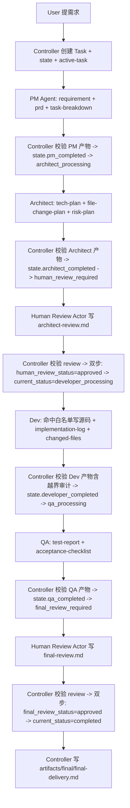

# Feature Flow — 新功能开发

> 用于新增页面、新增模块、新增业务流程、新增交互。

## 1. 适用场景

- 新增完整页面（如 Settings 页）
- 新增独立业务模块（如收藏夹、消息中心）
- 新增端到端流程（如下单 / 注册 / 订阅）
- 新增主要交互（如复杂的表单分步、抽屉/弹窗组合）

## 2. A2A task_type

`feature`

## 3. 执行顺序（mermaid）



## 4. Agent 调用顺序

User → Controller → PM → Controller → Architect → Controller → Human Review Actor → Controller → Dev → Controller → QA → Controller → Human Review Actor → Controller → (final-delivery)

## 5. Message 流转

| 序号 | 文件 | from → to | type | intent |
|---|---|---|---|---|
| 001 | from-controller-001-handoff.md | controller → pm | handoff | user_to_pm_handoff |
| 002 | from-pm-002-handoff.md | pm → architect | handoff | pm_to_architect_handoff |
| 003 | from-controller-003-handoff.md | controller → human | handoff | architect_to_human_review_handoff |
| 004 | from-controller-004-handoff.md | controller → dev | handoff | human_review_to_dev_handoff |
| 005 | from-controller-005-handoff.md | controller → qa | handoff | dev_to_qa_handoff_relay |
| 006 | from-qa-006-handoff.md | qa → human | handoff | qa_to_final_review_handoff |
| 007 | from-controller-007-status.md | controller → user | status / final | task completed |

## 6. Artifact 产物

| 阶段 | Artifact | produced_by |
|---|---|---|
| PM | requirement.md | pm |
| PM | prd.md | pm |
| PM | task-breakdown.md | pm |
| Architect | tech-plan.md | architect |
| Architect | file-change-plan.md | architect |
| Architect | risk-plan.md | architect |
| Human Review | architect-review.md | human-review-actor |
| Dev | implementation-log.md | dev |
| Dev | changed-files.md | dev |
| QA | test-report.md | qa |
| QA | acceptance-checklist.md | qa |
| Human Review | final-review.md | human-review-actor |
| Controller | final-delivery.md | controller |

## 7. 人工审核点

- **Architect Review**：架构方案 + file-change-plan + 风险方案三件套审核（必经）
- **Final Review**：测试报告 + 验收清单审核（必经）

## 8. 允许修改范围

- PM Agent：仅 `artifacts/pm/**` 与 `messages/from-pm-*.md`
- Architect Agent：仅 `artifacts/architect/**` 与 `messages/from-architect-*.md`，**严禁源码 Write**
- Dev Agent：`artifacts/developer/**` + `messages/from-developer-*.md` + 命中 file-change-plan 白名单的源码（双门禁后）
- QA Agent：`artifacts/qa/**` + `messages/from-qa-*.md` + 经 qa-file-change-plan 授权的测试文件
- Controller：`task.md` / `state.md` / `blockers/**` / `messages/from-controller-*.md` / `active-task.md` / `artifacts/final/**`（条件门禁）
- Human Review Actor：`human-reviews/*.md`

## 9. 禁止事项

- 跳过 PRD / tech-plan / Architect Review / Dev / QA / Final Review 任一阶段
- 在 human_review_status != approved 时让 Dev 写源码
- Dev 修改 file-change-plan 之外的文件
- Architect 任何源码 Write / StrReplace / Delete / Create
- QA 修改主业务代码
- Controller 写 artifacts/{pm,architect,developer,qa}/ 中的内容
- Controller 创建、修改 human-reviews/*.md
- 把双步审核流转合并成一步

## 10. Blocker 条件

- PM 阶段：用户原始需求严重不完整、scope 矛盾
- Architect 阶段：PM 产物缺漏、handoff message 缺 architect_must_answer
- Dev 阶段：5 条门禁不满足、file-change-plan 缺关键文件、需触碰默认禁改集
- QA 阶段：changed-files 越界、严重偏离 PRD、多用例同根因 fail
- 任意阶段：Schema 校验失败、Handoff Contract acceptance_criteria 不通过

## 11. 完成条件

- `state.current_status == completed`
- `state.final_review_status == approved`
- `artifacts/final/final-delivery.md` 已生成
- 所有 13+ 件 artifact + 2 份 review record 都被 final-delivery 引用

## 12. 启动 Prompt 模板

```
[A2A] 启动新功能 Flow
task_type: feature
title: <一句话需求>
priority: P1
human_owner: <你的 handle>
原始需求:
<把需求贴这里,含背景 / 用户群 / 核心价值 / 已知约束>

请 Flow Controller:
1. 在 .ai-agents/workspace/T-YYYY-NNN/ 下创建 task.md(仅静态元信息) 与 state.md(current_status: pm_processing)
2. 把 active_task_id 写入 .ai-agents/workspace/active-task.md
3. 生成 from-controller-001-handoff Message 召唤 PM Agent

不允许写源码,不允许跳过任何审核点。
每次回复以 [A2A] 头开始。
```
