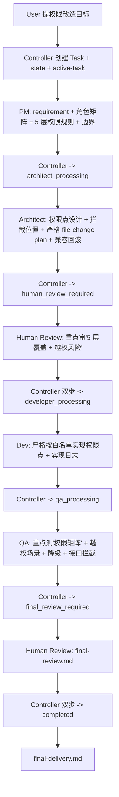

# Permission Flow — 权限改造

> 用于菜单权限、按钮权限、路由权限、角色权限、数据权限改造。

## 1. 适用场景

- 新增 / 调整角色
- 新增 / 调整菜单可见性
- 新增 / 调整按钮可见性 / 可点性
- 新增 / 调整路由准入
- 新增 / 调整数据可见性（行级 / 列级）

## 2. A2A task_type

`permission`

## 3. 执行顺序



## 4. Agent 调用顺序

User → Controller → PM → Controller → Architect → Controller → Human Review → Controller → Dev → Controller → QA → Controller → Human Review → Controller → final-delivery

## 5. Message 流转

与 feature-flow 相同；handoff message payload 增加 `role_matrix`（角色矩阵摘要）。

## 6. Artifact 产物

| 阶段 | Artifact | 说明 |
|---|---|---|
| PM | requirement.md | 权限改造背景 |
| PM | prd.md | **必含角色矩阵** + 菜单 / 路由 / 按钮 / 接口 / 数据 5 层规则 + 越权场景 |
| PM | task-breakdown.md | 按角色 × 权限层 拆解 |
| Architect | tech-plan.md | 权限点设计 + 拦截位置（前端守卫 + 接口校验 + 兜底） |
| Architect | file-change-plan.md | 权限拦截相关文件 |
| Architect | risk-plan.md | 重点：越权 / 漏放行 / 误拦截 |
| Human Review | architect-review.md | 重点："5 层都覆盖了吗 + 越权防护到位吗" |
| Dev | implementation-log.md | 含"哪个权限点拦在哪一层"记录 |
| Dev | changed-files.md | 越界审计 |
| QA | test-report.md | **角色矩阵测试** + 越权场景 + 降级 + 接口拦截 + 缓存 |
| QA | acceptance-checklist.md | 含每个角色 × 每个权限层勾选 |
| Human Review | final-review.md | 重点："越权场景全防住了吗" |
| Controller | final-delivery.md | 含权限矩阵摘要表 |

## 7. 人工审核点

- **Architect Review**：5 层权限覆盖 + 越权防护
- **Final Review**：越权场景实测验证

## 8. 允许修改范围

- 权限拦截相关文件（如 `routes/`、`hooks/usePermission`、`components/Authorized`、API service）
- 不得改业务核心逻辑（应另开 Task）

## 9. 禁止事项

- 仅做菜单 / 按钮隐藏不做接口拦截（必须 5 层都覆盖）
- 在前端做权限校验时不在接口层兜底
- 跳过越权场景测试
- 写死角色 → 权限映射在前端代码中（应放配置或后端返回）

## 10. Blocker 条件

- 角色矩阵不清 → 回到 PM
- 接口层无法拦截 → 回到 Architect 设计降级方案
- 越权测试发现漏放行 → 回到 Dev / Architect

## 11. 完成条件

- 与 feature-flow 相同
- 额外要求：acceptance-checklist 中**每个角色 × 每个权限层**至少 1 个用例 status == pass 或 manual_required+提供步骤

## 12. 启动 Prompt 模板

```
[A2A] 启动权限改造 Flow
task_type: permission
title: <一句话权限改造目标>
priority: P1
human_owner: <你的 handle>
权限改造目标:
- 角色: <角色 A / 角色 B / ...>
- 改造范围: <菜单 / 路由 / 按钮 / 接口 / 数据 5 层中的哪几层>
- 越权场景: <场景 1 / 场景 2 / ...>
- 不允许破坏的行为: <主流程 / 接口契约 / ...>

请 Flow Controller:
1. 在 .ai-agents/workspace/T-YYYY-NNN/ 下创建 task.md 与 state.md(current_status: pm_processing)
2. 把 active_task_id 写入 .ai-agents/workspace/active-task.md
3. 生成 from-controller-001-handoff Message 召唤 PM Agent
4. 提醒 PM: PRD 必含角色矩阵 + 5 层权限规则 + 越权场景

不允许跳过 5 层任一层,不允许只做前端隐藏不做接口拦截,不允许写源码,不允许跳过审核。
每次回复以 [A2A] 头开始。
```
