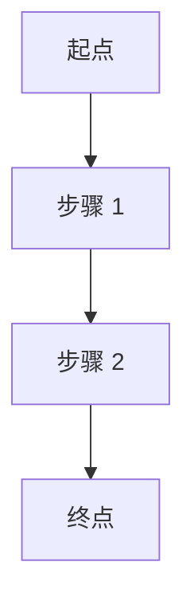

# PRD: <task_title>

> 用于 feature / refactor / permission / api-integration / ui-redesign。
> bugfix 不出 PRD,改出 bug-brief.md + regression-scope.md。

## 1. 用户角色

| 角色 | 描述 | 关键能力 |
|---|---|---|
| <角色 A> | <描述> | <能做什么> |
| <角色 B> | <描述> | <能做什么> |

## 2. 核心流程

主流程文字描述：

1. <步骤 1>
2. <步骤 2>
3. <步骤 3>

## 3. 页面 / 交互

### 3.1 <页面 1>

- 入口：<从哪进>
- 关键元素：<列表>
- 关键交互：<点击 / 输入 / 拖拽 / ...>

### 3.2 <页面 2>

...

## 4. 权限规则（5 层覆盖）

| 角色 \ 层 | 菜单 | 路由 | 按钮 | 接口 | 数据 |
|---|---|---|---|---|---|
| <角色 A> | ✓ | ✓ | ✓ | ✓ | 全部 |
| <角色 B> | ✓ | ✓ | 仅查看 | 只读 | 仅本人 |

越权场景：

- <场景 1>：预期表现 ...
- <场景 2>：预期表现 ...

## 5. 异常状态

| 异常 | 触发条件 | 期望表现 |
|---|---|---|
| 接口失败 4xx | ... | ... |
| 接口失败 5xx | ... | ... |
| 网络超时 | ... | ... |
| 字段缺失 | ... | ... |
| 字段类型异常 | ... | ... |

## 6. 边界场景

- 空数据：<期望表现>
- 大数据（>1000 条）：<期望表现>
- 极端输入：<期望表现>
- 并发：<期望表现>

## 7. 四态显式定义（loading / empty / error / success）

| 状态 | 视觉 | 文案 | 动作 |
|---|---|---|---|
| loading | 骨架屏 | "加载中…" | 无 |
| empty | 插画 + 引导 | "还没有数据,试试 X" | "去 X" 按钮 |
| error | 错误图标 + 信息 | "<错误信息>" | "重试" 按钮 |
| success | 正常渲染 | - | - |

## 8. 验收标准

> **必须**可被 QA 直接转为测试用例。

- [ ] <验收项 1>
- [ ] <验收项 2>
- [ ] <验收项 3>
- [ ] 所有 5 层权限按矩阵生效
- [ ] 所有异常状态有显式文案
- [ ] 所有四态都有视觉

## 9. 待确认问题

- [ ] <模糊点 1，需用户在 Architect Review 前给出方向>
- [ ] <模糊点 2>

## 10. 非目标（明确不做）

- <不做 1>
- <不做 2>
