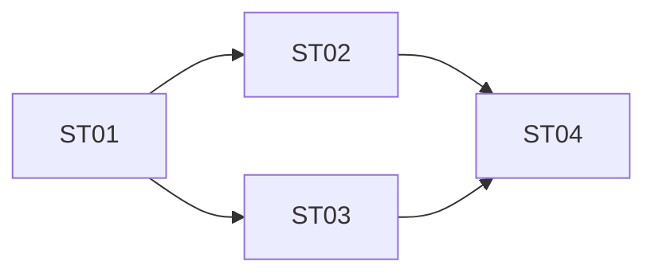

# Task Breakdown: <task_title>

> 每个子任务必须可独立估期且依赖清晰。bugfix 通常无需此 artifact，除非跨多个模块。

## 1. 子任务清单

| ID | 描述 | 输入 | 输出 | 估期 | 依赖 | 阻塞条件 |
|---|---|---|---|---|---|---|
| ST-01 | <子任务 1> | <来自> | <产物> | 0.5d | - | - |
| ST-02 | <子任务 2> | <来自> | <产物> | 1d | ST-01 | - |
| ST-03 | <子任务 3> | <来自> | <产物> | 0.5d | ST-01 | 若 X 接口未上 → blocked |

## 2. 子任务详情

### ST-01 <标题>

- **目标**：<...>
- **输入**：<...>
- **输出**：<...>
- **完成标准**：<可被验证>
- **风险**：<...>

### ST-02 <标题>

...

## 3. 关键路径

## 4. 总估期

<合计 / 关键路径估期>
