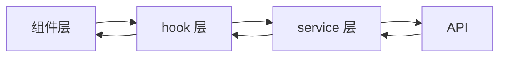
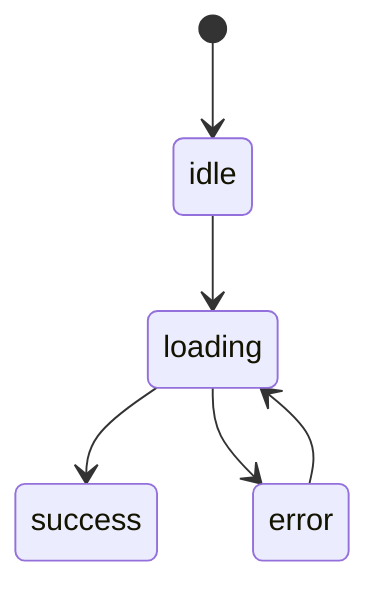

# Tech Plan: <task_title>

> 11 节均必填。"最小可行方案"非空（避免过度设计）。

## 1. 影响范围

- 新增：<列表>
- 修改：<列表>
- 不变：<列表>
- 间接影响（依赖方）：<列表>

## 2. 模块边界

- <模块 A> 负责 <职责>
- <模块 B> 负责 <职责>
- 模块间通信约定：<...>
- 不允许跨模块访问的内部细节：<...>

## 3. 数据流

## 4. 状态流

## 5. 接口契约

| 接口 | 方法 | 入参 | 返回 | 错误码 |
|---|---|---|---|---|
| /api/xxx | GET | { id } | { data } | 400/401/404/500 |
| /api/yyy | POST | { ... } | { ... } | 400/422/500 |

## 6. 权限控制点

- 路由守卫：<...>
- 接口拦截：<...>
- 按钮可见性：<...>
- 数据范围（行级 / 列级）：<...>

## 7. 第三方依赖

| 依赖 | 版本 | 必要性 | 引入风险 |
|---|---|---|---|
| 现有 X | y | 复用 | - |
| (新增) Z | w | 需 user-approved | 包大小 +nKB |

## 8. 最小可行方案（必填）

> **避免过度设计**。本节描述"最少改动 + 最简实现"的方案。

- 复用：<现有的 X / Y / Z>
- 不引入新依赖
- 不重构无关模块
- 仅本 Task 必要的最小代码改动

## 9. 风险点

| 风险 | 等级 | 触发条件 | 缓解 |
|---|---|---|---|
| <风险 1> | 高 / 中 / 低 | ... | ... |

## 10. 回滚方案

- 若改动出问题，按以下步骤回退：
  1. <步骤 1>
  2. <步骤 2>
- 回滚边界：<哪些已写入的数据 / 状态需要清理>

## 11. 待确认问题

- [ ] <技术决策 1，需用户在 Architect Review 前给方向>
- [ ] <技术决策 2>

## 附录：回答 PM handoff 中的 architect_must_answer

- Q1: <问题> → A: <回答>
- Q2: <问题> → A: <回答>
