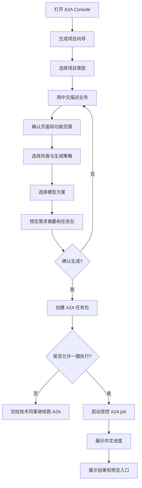

# PRD: A2A Console 中文小白模式与前端项目生成向导

## 1. 背景

A2A Console 目前更适合开发者查看任务状态、Agent 消息、Artifacts、Metrics 和模型配置。新的用户诉求是：让看不懂英文、不懂前端技术但会用中文描述业务的同事，也能通过页面选择模型/策略，并把需求交给 A2A 流程生成前端项目。

## 2. 产品定位

把 Console 升级为“双模式”：

- 普通模式：中文、少术语、向导式，默认给非技术同事使用。
- 专家模式：保留现有 A2A 详情、状态机、Artifacts、Metrics、模型 slug、调试能力。

## 3. 用户角色

| 角色 | 描述 | 关键能力 |
|---|---|---|
| 业务同事 | 不懂前端技术，但能描述业务 | 填需求、选模板、选模型策略、确认生成 |
| 项目负责人 | 能判断需求范围 | 审核摘要、确认页面清单、查看生成结果 |
| 技术负责人 | 懂 A2A / 前端 / 模型成本 | 切专家模式、调整模型、审核执行边界 |
| 开发者 | 接收 A2A 任务并实现 | 查看 OpenSpec/PRD/tech-plan/代码与 QA 结果 |

## 4. 核心流程

## 5. 页面与能力

### 5.1 生成项目入口

- 主标题：`你想生成什么前端项目？`
- 输入提示：`用中文描述你的业务，不用写技术名词。`
- 模板：企业官网、后台管理系统、CRM、数据看板、表单/审批系统、电商页面、自定义。

### 5.2 需求填写

- 项目名称、业务描述、使用人群、页面清单、数据字段、登录需求、图表需求、接口情况、参考网站/截图/Figma。
- 输入不足时提示补充，不直接阻断。

### 5.3 需求确认

- 系统整理项目一句话说明、页面清单、功能清单、数据对象、风格要求、不做范围。
- 用户可以编辑中文摘要。

### 5.4 模型选择

- 默认“系统推荐”。
- 选择卡片：系统推荐、更快、更强、更省、专家自定义。
- 普通模式展示中文解释；专家模式展示真实模型 slug、role override、context size。

### 5.5 任务包预览

- 展示即将创建的 Requirement、PRD、OpenSpec、页面清单、模型选择快照。
- 用户确认后才创建 A2A task。

### 5.6 生成进度

| A2A 内部阶段 | 普通模式文案 |
|---|---|
| pm_processing | 正在整理需求 |
| architect_processing | 正在设计实现方案 |
| human_review_required | 等待负责人确认方案 |
| developer_processing | 正在生成代码 |
| qa_processing | 正在检查质量 |
| final_review_required | 等待最终确认 |
| completed | 已完成，可以预览 |
| blocked | 需要补充信息 |

### 5.7 结果页

- 展示生成项目名称、页面清单、生成目录、预览入口或中文运行步骤、质量检查结果、下一步建议。

## 6. 安全与边界

- 浏览器不保存 API Key。
- 普通用户不能输入 shell 命令。
- 如果实现一键启动 A2A，只能调用固定白名单 runner，且必须二次确认。
- 输出目录必须在白名单 output_root 内，禁止路径穿越、绝对路径注入、软链逃逸。
- 专家模式只改变展示，不绕过权限。

## 7. 验收标准

- [ ] 非专家默认看到“生成项目”向导。
- [ ] 页面主要文案为中文。
- [ ] 用户能选择项目类型、填写中文业务描述、选择页面范围和风格。
- [ ] 模型选择能用中文解释“推荐 / 更快 / 更强 / 更省”。
- [ ] 专家模式能查看真实模型 slug 和 A2A 原始信息。
- [ ] 用户确认前能预览 Requirement / PRD / OpenSpec 摘要。
- [ ] 确认后能创建 A2A 任务包。
- [ ] 若实现一键执行，必须有二次确认、job 状态、失败态和取消/停止策略。
- [ ] blocker 文案能让非技术用户知道需要补充什么。
- [ ] 新增 API 有 zod contract，client/server safeParse。
- [ ] 新增写入路径防路径穿越。
- [ ] 不破坏现有专家功能。

## 8. 待确认

- MVP 是否允许 Console 直接启动 A2A 执行？
- 生成项目输出目录在哪里？
- 是否允许覆盖同名项目？
- 默认技术栈是否固定为 React/Vite/Tailwind？
- 是否支持上传截图 / Figma 链接？
- 是否需要管理员锁定可选模型？

## 9. 非目标

- 不做云端多租户。
- 不做账号系统。
- 不自动部署。
- 不承诺一次生成即可上线。
- 不移除专家模式。
- 不让浏览器直接调用 LLM API。
